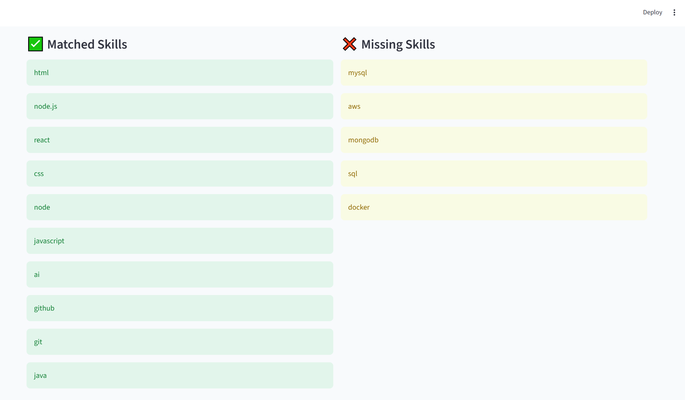
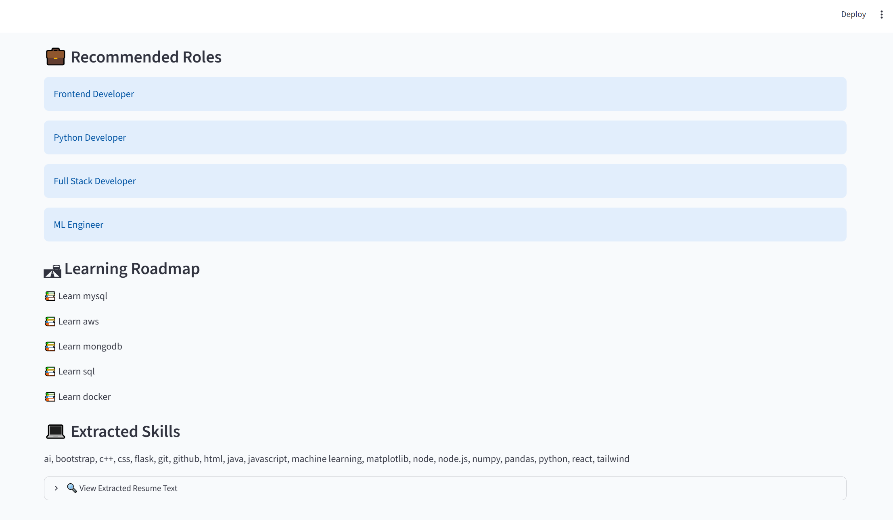

# 🚀 AI Resume Screening System

AI Resume Screening System is an intelligent Resume Screening and Career Guidance Platform designed to help students and job seekers evaluate their resumes against industry requirements. The system automatically extracts resume data, analyzes skills, compares them with job descriptions, calculates ATS (Applicant Tracking System) compatibility scores, identifies skill gaps, and provides personalized career recommendations.

The platform leverages Python, Streamlit, Machine Learning, and Natural Language Processing techniques to deliver meaningful insights that help candidates improve their resumes and prepare for their desired roles.

## Key Features

* 📄 Resume Parsing and Text Extraction from PDF resumes
* 🎯 ATS Score Calculation based on job descriptions
* 💻 Automatic Skill Extraction and Analysis
* ✅ Skill Matching and Gap Identification
* 📊 Interactive Analytics Dashboard
* 💼 Career Role Recommendations
* 🛣 Personalized Learning Roadmap
* 📈 Data Visualization using Charts and Graphs
* 🔍 Resume Insights and Improvement Suggestions

## Technologies Used

* Python
* Streamlit
* Scikit-Learn
* Pandas
* Plotly
* PDFMiner
* Machine Learning
* Natural Language Processing (NLP)

## Project Objective

The objective of this project is to bridge the gap between academic skills and industry requirements by providing candidates with actionable insights that enhance employability and improve resume quality.

This project demonstrates the practical application of Artificial Intelligence, Machine Learning, Data Analysis, and Software Development concepts in solving real-world recruitment and career guidance challenges.

# 📷 Project Screenshots

## 🏠 Home Page

---

## 📊 Dashboard

---

## 💻 Skill Analysis

---

## 💼 Career Recommendations

